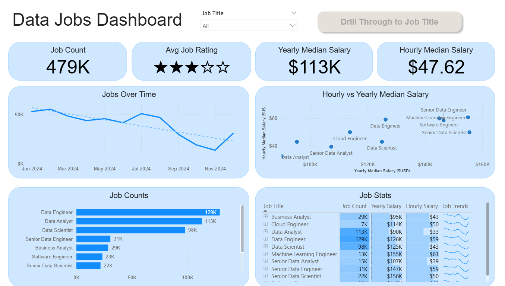
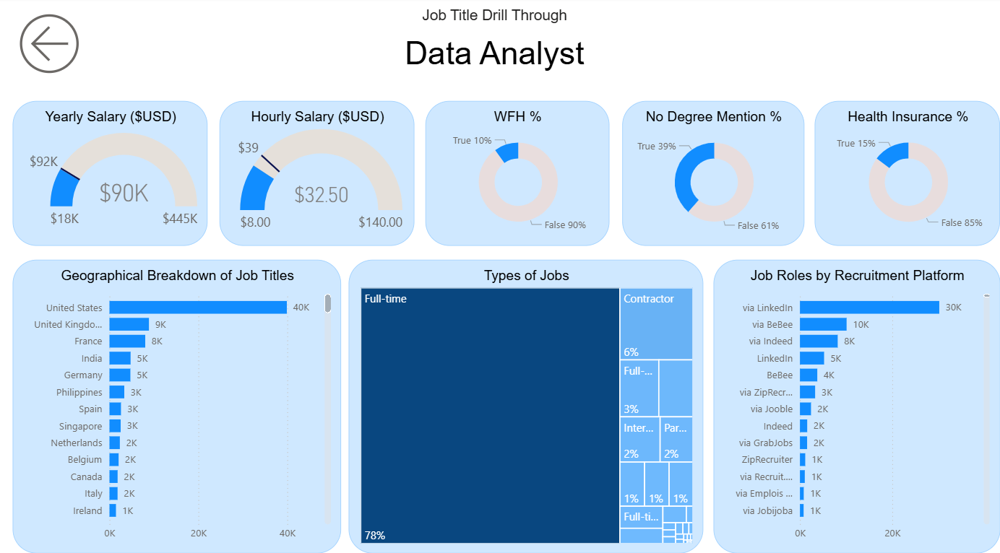

# PowerBI-Data-Jobs-Insights

## Introduction
The Data Jobs Dashboard is an interactive Power BI solution designed to provide comprehensive insights into the data job market. With the rapid expansion of data-driven roles, understanding job distribution, salary benchmarks, and evolving market trends has become critical for professionals, recruiters, and organizations.

This dashboard consolidates job-related data, transforming it into actionable intelligence through advanced Power BI features. It offers a dual-view experience:
1. Main Dashboard – A holistic overview of all data job roles, trends, and key performance indicators.
2. Drillthrough Dashboard – Role-specific insights (e.g., Data Analyst, Data Engineer, Data Scientist), accessible via an interactive drillthrough button.

The objective of this project is to democratize job market insights, making complex data accessible in a visually appealing and decision-friendly format.
## Skills Showcased
This dashboard highlights a comprehensive set of Power BI and data visualization competencies, reflecting industry-relevant skills in data analytics and reporting:
### 🔄 Data Transformation (ETL) with Power Query
- Applied advanced data preparation techniques, including cleaning, merging, and reshaping datasets.
- Built an efficient ETL pipeline to ensure high-quality, analysis-ready data.
### 📏 Implicit Measures
- Utilized Power BI’s built-in aggregation functions (SUM, AVERAGE, COUNT, etc.) to quickly generate insights.
- Demonstrated an understanding of when implicit measures are sufficient versus when custom DAX measures are required.
### 📊 Core Charts & Visualizations
- Designed bar charts, line graphs, scatter plots, and tree maps to effectively represent trends, comparisons, and distributions.
- Ensured visuals are aligned with storytelling principles and best practices in data visualization.
### 🎯 KPI Indicators & Summary Tables
- Built KPI cards for job counts, average ratings, and salary benchmarks.
- Designed supporting tables for detailed breakdowns, enabling quick drill-down into granular insights.
### 🖥️ Dashboard Design & Layout
- Created a clean, intuitive, and professional layout with consistent formatting.
- Applied principles of readability, color harmony, and user-centered design to enhance usability.
### ⚡ Interactive Reporting Features
- Slicers: Enabled dynamic filtering across multiple job roles and categories.
- Buttons & Bookmarks: Added custom navigation controls for seamless user experience.
- Drillthrough Functionality: Implemented contextual deep dives, allowing users to move from a high-level overview to role-specific insights with a single click.
## Dashboard Overview
### Page 1: High Level Market View

*Provides a high-level summary of the data job market, including job counts, salary trends, and overall market dynamics. This page serves as the entry point for understanding the broader landscape of data-related roles.*

### Page 2: Drill Through Job Title

*Activated via the drillthrough button on the main page. It enables users to dive deeper into a specific job role (e.g., Data Analyst, Data Scientist, Data Engineer) and explore role-focused insights such as salary distributions, work-from-home percentages, degree requirements, job types, and recruitment platforms.*
## Conclusion
Developing this Data Jobs Dashboard has been a valuable journey in transforming raw job market data into actionable insights through Power BI. The project not only highlights the current state of data-related roles—covering job counts, salary distributions, and market dynamics—but also demonstrates how interactive features such as drillthrough, slicers, and bookmarks can turn a static dataset into a compelling story.

Through this project, I strengthened my skills in data transformation, visualization design, and interactive reporting. I learned how to balance technical accuracy with user experience, ensuring that the dashboard is both insightful and intuitive to navigate. More importantly, the process deepened my understanding of how business intelligence tools like Power BI can bridge the gap between data and decision-making.

